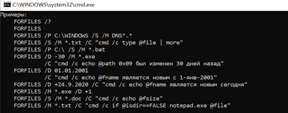

# УТИЛИТА FORFILES КОМАНДНОЙ СТРОКИ CMD

## Техническое задание

# СОДЕРЖАНИЕ

1. [ВВЕДЕНИЕ](#ВВЕДЕНИЕ)  
   1.1. [Наименование](#Наименование)  
   1.2. [Краткая характеристика области применения](#Краткая)
2. [ОСНОВАНИЯ ДЛЯ РАЗРАБОТКИ](#ОСНОВАНИЯ)  
   2.1. [Основания для проведения разработки](#Основания)  
   2.2. [Наименование и условное обозначение темы разработки](#Наименованиеиус)
3. [НАЗНАЧЕНИЕ РАЗРАБОТКИ](#НАЗАНЧЕНИЕ)  
   3.1. [Функциональное назначение](#Функциональное)  
   3.2. [Эксплуатационное назначение](#Эксплуатационное)
4. [ТРЕБОВАНИЯ К ПРОГРАММЕ](#ТРЕБОВАНИЯ)  
   4.1. [Требования к функциональным характеристикам](#Требованиякфун)  
   4.1.1. [Требования к составу выполняемых функций](#Требованияксоста)  
   4.1.2. [Требования к организации входных и выходных данных](#Требованиякорг)  
   4.1.3 [Требования к временным характеристикам](#Требованияквре)  
   4.2 [Требования к надежности](#Требованиякнад)  
   4.2.1 [Требования к обеспечению устойчивости функционирования](#Требованиякобес)  
   4.2.2. [Контроль входной и выходной информации](#Контроль)  
   4.2.3. [Время восстановления после отказа](#Время)  
   4.3. [Условия эксплуатации](#Условия)  
   4.3.1. [Климатические условия эксплуатации](#Климатические)  
   4.3.2. [Требования к видам обслуживания](#Требованияквид)  
   4.3.3. [Требования к численности и квалификации персонала](#Требованиякчис)  
   4.4. [Требования к составу и параметрам технических средств](#Требованияксост)  
   4.5. [Требования к информационной и программной совместимости](#Требованиякинфо)  
   4.5.1. [Требования к информационным структурам и методам решения](#Требованиякинф)  
   4.5.2. [Требования к исходным кодам и языкам программирования](#Требованиякисх)  
   4.5.3 [Требования к программным средствам, используемых программой](#Требованиякпро)  
   4.5.4. [Требования к защите информации и программ](#Требованиякзащ)  
   4.6. [Требования к маркировке и упаковке](#Требованиякмар)  
   4.7. [Требования к транспортированию и хранению](#Требованияктр)  
   4.8. [Специальные требования](#Специальныетр)
5. [ТРЕБОВАНИЯ К ПРОГРАММНОЙ ДОКУМЕНТАЦИИ](#ТРЕБОВАНИЯ)  
   5.1. [Предварительный состав программной документации](#Предварительный)  
   5.2. [Специальные требования к программной документации](#Специальные)
6. [ТЕХНИКО-ЭКОНОМИЧЕСКИЕ ПОКАЗАТЕЛИ](#ТЕХНИКО)  
   6.1. [Ориентировочная экономическая эффективность](#Ориантировочная)  
   6.2. [Предполагаемая годовая потребность](#Предполагаемая)  
   6.3. [Экономические преимущества разработки](#Экономические)
7. [СТАДИИ И ЭТАПЫ РАЗРАБОТКИ](#СТАДИИ)  
   7.1. [Стадии разработки](#Стадии)  
   7.2. [Этапы разработки](#Этапы)  
   7.3. [Содержание работ по этапам](#Содержание)
8. [ПОРЯДОК КОНТРОЛЯ И ПРИЕМКИ](#ПОРЯДОК)  
   8.1. [Виды испытаний](#Виды)  
   8.2. [Общие требования к приемке работы](#Общие)

# 1. ВВЕДЕНИЕ

---

## 1.1. Наименование

---

Наименование – «Утилита FORFILES командной строки CMD».

## 1.2. Краткая характеристика области применения

---

Утилита FORFILES используется для выбора файла (или набора файлов) и выполнения команды с этим файлом. Программа полезна для пакетных заданий.

# 2. ОСНОВАНИЯ ДЛЯ РАЗРАБОТКИ

---

## 2.1. Основания для проведения разработки

---

Основанием для проведения разработки является лабораторная работа №1 по дисциплине «Технология разработки программного обеспечения АСОИУ». Лабораторная работа утверждена Сувальским А.А., в дальнейшем именуемым Заказчиком. Дата утверждения 09.10.20.

## 2.2. Наименование и условное обозначение темы разработки

---

Наименование темы разработки – «Разработка утилиты FORFILES».
Условное обозначение темы разработки – «A.B.00001».

# 3. НАЗНАЧЕНИЕ РАЗРАБОТКИ

---

## 3.1. Функциональное назначение

---

Функциональным назначением утилиты является нахождение последовательности папок для файлов и папок, соответствующих определенным критериям, а также выполнение команд над ними.

## 3.2. Эксплуатационное назначение

---

Утилита FORFILES должна эксплуатироваться в интерпретаторе командной строки CMD или в пакетном файле.

# 4. ТРЕБОВАНИЯ К ПРОГРАММЕ

---

## 4.1. Требования к функциональным характеристикам

---

### 4.1.1. Требования к составу выполняемых функций

---

Утилита FORFILES должна обеспечивать возможность выполнения перечисленных ниже функций:

1. функция выполнения команды для выбранных пакетов файлов;
2. функция выполнения команд для всех подходящих имен каталогов;
3. функция выполнения команды поиска по маске и (или) дате изменения файла или папки.

### 4.1.2. Требования к организации входных и выходных данных

---

4.1.2.1. Утилита FORFILES должна иметь синтаксис, изображенный на рисунке ниже.

Здесь используются:

1. _/P <путь>_ – это путь, с которого начинается поиск. По умолчанию используется текущая рабочая папка (.).

2. _/M <маска поиска>_ – это поиск файлов с помощью маски. Маска поиска по умолчанию "\*".

3. _/S_ – это рекурсивное выполнение программы FORFILES во всех подпапках, аналогично "DIR /S".

4. _/C <команда>_ – команда, которая выполняется для каждого файла. Строки команд необходимо заключать в прямые кавычки. Команда по умолчанию "cmd /c echo @file".

5. _/D <дата>_ – это выбор файлов, у которых дата последнего изменения больше или равна (+) либо меньше или равна (-) указанной дате при использовании формата "dd.MM.yyyy"; либо файлов, у которых дата последнего изменения больше или равна (+) текущей дате плюс "dd" дней либо меньше или равна (-) текущей дате минус "dd" дней. Допустимым числом дней "dd" является любое число в диапазоне 0 - 32768. "+" используется по умолчанию, если знак не указан.

4.1.2.2. Следующие переменные могут использоваться в строке _/C <команда>_:

- _@file_ – возвращает имя файла;

- _@fname_ – возвращает имя файла без расширения;

- _@ext_ – возвращает только расширение имени файла;

- _@path_ – возвращает полный путь к файлу;

- _@relpath_ – возвращает относительный путь к файлу;

- _@isdir_ – возвращает значение "TRUE", если типом файла является папка, и "FALSE" для файлов;

- _@fsize_ – возвращает размер файла в байтах;

- _@fdate_ – возвращает дату последнего изменения файла;

- _@ftime_ – возвращает время последнего изменения файла.

  4.1.2.3. Для включения специальных символов в строку команды следует использовать шестнадцатеричный код символа в формате 0xHH (например, 0x09 для табуляции).
  Перед внутренними командами CMD.exe необходимо ставить _"cmd /c"_.

  4.1.2.4. Примеры использования утилиты FORFILES, представленные при выводе справки об использовании:

1. вывод справки по использованию;

2. отобразить список файлов текущего каталога;

3. отобразить список файлов программ из системного каталога Windows (/P C:\windows\system32);

4. отобразить список файлов текущего каталога с расширением .exe в постраничном режиме вывода на экран;

5. вывод списка файлов и подкаталогов каталога;

6. обработки файлов, старше определенного количества дней;

7. обработка файлов с текущей датой создания (изменения);

8. удаление (копирование, перемещение) файлов старше определенной даты;

9. отобразить список файлов текущего каталога с расширением .exe определенной даты;

10. вывод списка расширений имен файлов в текущем каталоге в формате столбца и добавление вкладки перед расширением;

11. подача звукового сигнала, если в папке присутствует файл.

Данные команды представлены на рисунке ниже.

### 4.1.3. Требования к временным характеристикам

---

Требования к временным характеристикам программы не предъявляются.

## 4.2. Требования к надежности

---

### 4.2.1. Требования к обеспечению устойчивости функционирования

---

Надежное (устойчивое) функционирование программы должно быть обеспечено выполнением совокупности организационно-технических мероприятий:

1. организацией бесперебойного питания технических средств;
2. выполнением рекомендаций Министерства труда и социального развития РФ, изложенных в Постановлении от 23 июня 1998 г. «Об утверждении межотраслевых типовых норм времени на работы по сервисному обслуживанию ПЭВМ и оргтехники и сопровождению программных средств»;
3. выполнением требований ГОСТ 51188-98. Защита информации. Испытания программных средств на наличие компьютерных вирусов;
4. необходимым уровнем квалификации сотрудников профильных подразделений.

### 4.2.2. Контроль входной и выходной информации

---

В случае неправильного ввода команды FORFILES, командная строка должна вывести сообщение, данный случай описан на рисунке ниже.

### 4.2.3. Время восстановления после отказа

---

Время восстановления после отказа должно не превышать 30 минут.

## 4.3. Условия эксплуатации

---

### 4.3.1. Климатические условия эксплуатации

---

Программа должна работать в закрытых помещениях, при нормальных климатических условиях.
Температура окружающего воздуха должна быть в диапазоне 20-25 градусов, относительная влажность на уровне 40-60%.

### 4.3.2. Требования к видам обслуживания

---

Проводится периодическое тестирования программы, раз в полгода.

### 4.3.3. Требования к численности и квалификации персонала

---

Минимальное количество персонала, требуемого для работы программы, должно составлять не менее двух штатных единиц – системный программист и конечный пользователь программы – оператор.
Системный программист должен иметь минимум среднее техническое образование. В перечень задач, выполняемых системным программистом, должны входить:

1. задача поддержания работоспособности технических средств;
2. задача установки (инсталляции) и поддержания работоспособности системного программного средства – операционной системы;
3. задача установки (инсталляции) программы.
   Конечный пользователь программы (оператор) должен обладать практическими навыками работы с графическим пользовательским интерфейсом операционной системы.

## 4.4. Требования к составу и параметрам технических средств

---

В состав технических средств должен входить IBM-совместимый персональный компьютер (ПЭВМ), включающий в себя:

1. процессор Pentium – 4 с тактовой частотой не менее 300 МГц;
2. оперативную память объемом не менее 128 Мб;
3. жесткий диск объемом 1,5 Гб и выше.

## 4.5. Требования к информационной и программной совместимости

---

### 4.5.1. Требования к информационным структурам и методам решения

---

Требования к информационным структурам на входе и выходе, а также к методам решения не предъявляются.

### 4.5.2. Требования к исходным кодам и языкам программирования

---

Исходные коды программы должны быть реализованы в пакетном файле или непосредственно в интерпретаторе командной строки CMD.

### 4.5.3. Требования к программным средствам, используемых программой

---

Должна использоваться командная строка, встроенная в операционную систему Windows.

### 4.5.4. Требования к защите информации и программ

---

Требования к защите информации и программ не предъявляются.

## 4.6. Требования к маркировке и упаковке

---

Требования к маркировке и упаковке не предъявляются.

## 4.7. Требования к транспортированию и хранению

---

Требования к транспортированию и хранению не предъявляются.

## 4.8. Специальные требования

---

Специальные требования к программе не предъявляются.

# 5. ТРЕБОВАНИЯ К ПРОГРАММНОЙ ДОКУМЕНТАЦИИ

---

## 5.1. Предварительный состав программной документации

---

Состав программной документации должен включать в себя:

1. техническое задание;
2. спецификация;
3. текст программы;
4. описание программы;
5. программу и методики испытаний;
6. пояснительную записку;
7. ведомость эксплуатационных документов;
8. формуляр;
9. описание применения;
10. руководство системного программиста;
11. руководство программиста;
12. руководство оператора.

## 5.2. Специальные требования к программной документации

---

Специальные требования к программной документации не предъявляются.

# 6. ТЕХНИКО-ЭКОНОМИЧЕСКИЕ ПОКАЗАТЕЛИ

---

## 6.1. Ориентировочная экономическая эффективность

---

Ориентировочная экономическая эффективность не рассчитывается.

## 6.2. Предполагаемая годовая потребность

---

Предполагаемая годовая потребность не рассчитывается.

## 6.3. Экономические преимущества разработки

---

Экономические преимущества разработки не рассчитываются.

# 7. СТАДИИ И ЭТАПЫ РАЗРАБОТКИ

---

## 7.1. Стадии разработки

---

Разработка должна быть предъявлена в три стадии:

1. разработка технического задания;
2. рабочее проектирование;
3. внедрение.

## 7.2. Этапы разработки

---

На стадии разработки технического задания должен быть выполнен этап разработки, согласования и утверждения с Заказчиком и Исполнителем настоящего технического задания.
На стадии рабочего проектирования должны быть выполнены следующие этапы работ:

1. разработка программы;
2. разработка программной документации;
3. испытания программы.
   На стадии внедрения должен быть выполнен этап разработки – подготовка и передача программы.

## 7.3. Содержание работ по этапам

---

На этапе разработки технического задания должны быть выполнены следующие виды работ:

1. постановка задачи;
2. определение и уточнение требований к техническим средствам;
3. определение требований к программе;
4. определение стадий, этапов и сроков разработки программы и документации на неё;
5. выбор языков программирования;
6. согласование и утверждение технического задания.
   На этапе разработки программы должна быть выполнена работа программированию и отладке программы.
   На этапе разработки программной документации должна быть выполнена разработка программных документов в соответствии с требованиями ГОСТ 19.101-77 и требованием п. «Предварительный состав программной документации» настоящего технического задания.
   На этапе испытаний программы должны быть выполнены следующие виды работ:
7. разработка, согласование и утверждение программы и методики испытаний;
8. проведение приёмо-сдаточных испытаний;
9. корректировка программы и программной документации по результатам испытаний.
   На этапе подготовки и передачи программы должна быть выполнена подготовка и передача программы и программной документации в эксплуатацию на объектах Заказчика.

# 8. ПОРЯДОК КОНТРОЛЯ И ПРИЕМКИ

---

## 8.1. Виды испытаний

---

Приемо-сдаточные испытания программы должны проводиться согласно разработанной Исполнителем и согласованной Заказчиком «Программы и методики испытаний».
Ход проведения приемо-сдаточных испытаний Заказчик и Исполнитель документируют в Протоколе проведения испытаний.

## 8.2. Общие требования к приемке работы

---

После проведения испытаний в полном объеме, на основании «Протокола испытаний» утверждают «Свидетельство о приемке» и производят запись в программном документе «Формуляр».
